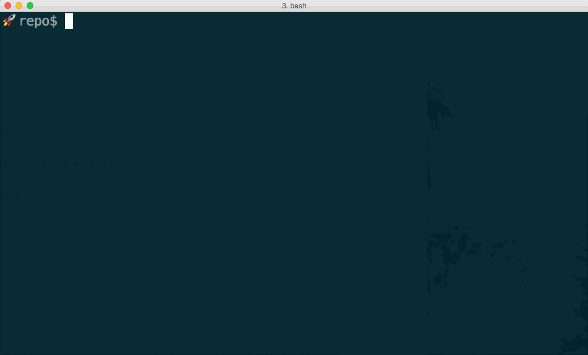

# mkchoice

`mkchoice` is a tool for prompting a choice from a user, which is
compatible with shell pipelines:



It does this by writing the prompt to the user's tty, instead of using
stdin/stdout.

```
$ mkchoice -h
Usage: mkchoice [-h|--help] [-v|--vanish]
            [-p|--prompt <prompt>] [-s|--selection <selection>]
            [args] [-- <args>]

  mkchoice prompts the user's tty to choose one of the given options,
  and outputs the chosen option. Pass - as one of the args to also read
  line-separated options from stdin. Arguments after -- are taken as
  literal options, not interpreted as flags. If you pass no arguments,
  mkchoice will read from stdin by default.

  You can pass the initially selected value with --selection, which
  accepts the text of an option that will appear in the list, or an
  index in the list. It defaults to the first item if the specified
  one can't be found.

  Change the selected option with up/down or j/k, and confirm your
  selection with space or enter.

  If the --vanish flag is given, the prompt will be erased from the
  terminal before the output is shown. Otherwise, the final state of
  the prompt will still be visible on the screen.

  Example:

  $ seq 3 | mkchoice -s master a - b -p "Which one?" -- -p -h - -- master z >some-file
  Which one?
    a
    1
    2
    3
    b
    -p
    -h
    -
    --
  > master
    z
  $ cat some-file
  master
```
